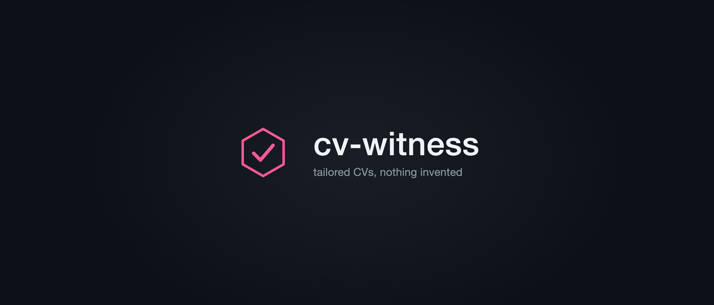

<p align="center">
  
</p>

<h1 align="center">cv-witness</h1>

<p align="center">
  <a href="#verification-principles"></a>
  <a href="#how-cv-witness-differs"></a>
  <a href="https://github.com/rezi-io/rezi-mcp"></a>
  <a href="https://github.com/Mihai-Codes/cv-witness/blob/main/LICENSE"></a>
  <a href="https://github.com/Mihai-Codes/cv-witness/pulls"></a>
</p>

An [AdaL](https://adalagent.ai/) skill that turns **verified experience** into tailored, ATS-safe, one-page CVs — tailored CVs, nothing invented. Works as a standalone personal skill or in tandem with the [Rezi MCP](https://github.com/rezi-io/rezi-mcp).

## How cv-witness differs

The job-hunt skill space is crowded: broad agents scan job boards and fill applications, template packs generate LaTeX and HTML resumes by the dozen. cv-witness is deliberately narrow. It is the CV skill whose output cannot lie, and the gates are structural, not vibes:

- **Merge-checked citations.** Every open-source PR cited on the CV is verified against the GitHub API first; closed-unmerged work is never presented as merged.
- **The `[FILL: …]` gate.** A plausible metric that is not confirmed becomes a visible marker, never a guess. Nothing fabricated can slip through, because the rule is in the workflow, not the model's mood.
- **Mechanical output verification.** Every render is checked with `pdftotext` extraction, a one-page assertion, and a placeholder scan — not "looks good to me".
- **Data and code are separated.** Your master resume (`foundation.md`) is personal data: gitignored, never committed, never published.
- **Approval before render.** The tailored content is reviewed with you before any PDF exists.
- **No job-description mirroring.** The posting informs emphasis and ordering only; bullets stay in the candidate's own words. Resumes that match a posting too closely are increasingly flagged by screening software and experienced reviewers alike.
- **Narrow on purpose.** cv-witness is not a job finder; discovery and auto-apply belong to the broad agents. This skill does one thing: craft and verify the CV itself, down to how every element parses.

Most resume skills help you say more. This one helps you say only what is true, and prove it.

## What it does

- **Maps a job posting to your evidence.** Required vs. preferred qualifications are matched against your master resume, your GitHub record, and facts you confirm — with unsupported requirements flagged as gaps, not papered over.
- **Verifies external claims.** Any open-source PR cited on the CV is merge-checked against the GitHub API first. Closed-unmerged work is never presented as merged.
- **Tailors without inflating.** Reorders and rephrases what is real; uses `[FILL: …]` markers where a metric is plausible but unconfirmed, so nothing fabricated slips through.
- **Renders an ATS-safe PDF.** Single column, no tables, one muted accent, real text everywhere — via headless Chrome.

## Works with Rezi (optional)

If you connect the [Rezi MCP server](https://github.com/rezi-io/rezi-mcp), the skill can use your Rezi account as a live source: listing and reading your saved resumes, checking the current section schema, and — only with your explicit approval — writing tailored content back to a chosen resume, then reading it back to verify. Reads are the default; writes are always opt-in. Without Rezi, the skill runs entirely on local sources.

## Install

The repo root is the skill: one `SKILL.md`, valid for every host that reads the SKILL.md standard (AdaL, Claude Code, Codex, Copilot, Gemini CLI, and more).

```bash
# AdaL
git clone https://github.com/Mihai-Codes/cv-witness.git ~/.adal/skills/cv-witness

# Claude Code — as a plugin (recommended)
#   /plugin marketplace add Mihai-Codes/cv-witness
#   /plugin install cv-witness
# or as a personal skill:
git clone https://github.com/Mihai-Codes/cv-witness.git ~/.claude/skills/cv-witness

# Codex (reads SKILL.md directories; symlinked folders supported)
git clone https://github.com/Mihai-Codes/cv-witness.git ~/.agents/skills/cv-witness

# Any agent that reads AGENTS.md — keep the repo checked out and read SKILL.md
```

Requirements: an agent host, a Chrome-family browser (PDF rendering), and the [`gh` CLI](https://cli.github.com/) authenticated for merge-state verification and the JD-overlap lint.

## Usage

Point AdaL at a job posting and ask for a tailored CV. Typical prompts:

> "Tailor my CV for this role: <posting URL or text>"

> "Find roles matching my profile and draft the top application"

The skill gathers the posting, maps it to evidence, proposes the tailored content, and renders the final PDF to `~/Downloads/` after you approve the content.

## Repository structure

```text
SKILL.md         # the skill: workflow, rules, safety boundaries
template.html    # ATS-safe one-page layout (single column, inline SVG contact icons)
render.sh        # HTML → PDF via headless Chrome/Brave/Edge/Chromium
assets/          # banner.png + banner.html (its deterministic source)
```

Regenerate the banner: `chrome --headless --screenshot=assets/banner.png --window-size=2100,900 assets/banner.html`. The wordmark is real type, not model-drawn, so it can never be misspelled.

**Intentionally not in this repo:** `foundation.md`, the private master resume the skill reads at runtime. Keep yours at `~/.adal/skills/cv-witness/foundation.md` — it is personal data and must never be committed here.

## Verification principles

1. Every experience, metric, and credential traces to the master resume, a confirmed fact, or a public artifact.
2. External PRs and issues are checked for merge/state before they are cited.
3. Unverifiable but plausible metrics become `[FILL: …]` markers, never guesses.
4. Expired or in-progress credentials are labelled as such or omitted.
5. No ATS scores, rankings, or interview promises — those cannot be honestly guaranteed. Output is instead validated mechanically: `pdftotext` extraction, one-page check, placeholder scan, and the ATS checklist in `SKILL.md`.

## Contributing

PRs welcome — see [CONTRIBUTING.md](CONTRIBUTING.md). Small, focused PRs get the fastest review; non-code contributions (docs, template variants, render targets) are as valuable as code.

## Roadmap

- [x] Fix bullet-marker clipping and header/footer spacing in the template (2026-10)
- [x] Merge-state verification for external PRs before citing (2026-10)
- [x] Drive a host assistant's native DOCX flow end-to-end (Amazon Quick, 2026-10-08)
- [x] Split verification notes into a private provenance file; portable paths via a configuration section (2026-10-08)
- [x] JD-overlap lint: a script that flags CV phrasing shared with the posting (2026-10-08)
- [x] Claude Code plugin and marketplace manifests; Codex and AGENTS.md support (2026-10-08)
- [ ] Voice-sample support: match the owner's writing style from a personal corpus
- [ ] Landing page (GitHub Pages enabled; design pending)
- [ ] Additional render targets and template variants per career lane

## License

[MIT](LICENSE)

Personal project by [Mihai-Alexandru Chindriș](https://mihaichindris.me). Not affiliated with or endorsed by Amazon, Yubico, Rezi, or any employer named in examples.