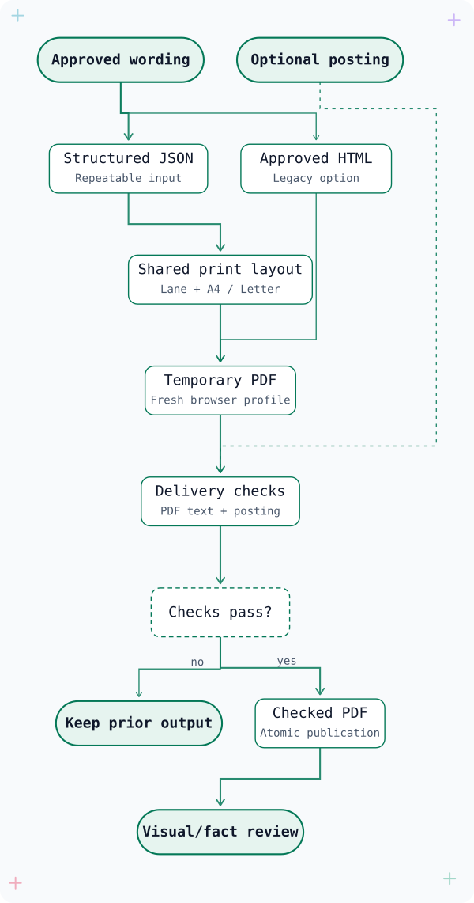

<p align="center">
  
</p>

<h1 align="center">cv-witness</h1>

<p align="center">
  <a href="https://github.com/Mihai-Codes/cv-witness/releases/latest"></a>
  <a href="LICENSE"></a>
  <a href="https://github.com/Mihai-Codes/cv-witness/pulls"></a>
</p>

<p align="center">
  <a href="https://mihai-codes.github.io/cv-witness/">Website</a> ·
  <a href="#install">Install</a> ·
  <a href="https://github.com/Mihai-Codes/cv-witness/issues/1">Roadmap</a>
</p>

An open-source agent skill for drafting and reviewing a CV from your real experience. It helps you select relevant work, trace claims to a source and inspect the exported document. You review the facts and wording before applying.

## How cv-witness differs

The job posting guides emphasis and ordering. It should not become a script for rewriting your history. Describe the work you did, keep accurate technical terms, and flag missing facts instead of inventing them.

The skill asks your agent to:

- Check dates, credentials, metrics and contribution claims against your sources. Verify a public pull request's merge state before calling it merged.
- Use `[FILL: ...]` markers in a draft when information is missing, then resolve or remove them before delivery.
- Run the phrase-overlap script and review shared wording in context. A common technical phrase is not proof of copying and need not be changed just to avoid a match.
- Inspect the exported text, page count, placeholders and layout before sending the CV.

These are workflow instructions, not guarantees an agent cannot bypass. The PDF renderer creates a file; it does not automatically certify its contents. No ATS parsing result, ranking, exact voice match or interview is promised.

## Install

One root `SKILL.md` is shared by every installation. The template and scripts live beside it, so there are no duplicate skills or recursive directory links.

### AdaL

```sh
git clone https://github.com/Mihai-Codes/cv-witness.git ~/.adal/skills/cv-witness
```

### Claude Code

Send these as two separate commands inside Claude Code:

```text
/plugin marketplace add Mihai-Codes/cv-witness
/plugin install cv-witness@cv-witness
```

The plugin manifest points to the root skill. Alternatively, install a personal skill:

```sh
git clone https://github.com/Mihai-Codes/cv-witness.git ~/.claude/skills/cv-witness
```

### Codex

```sh
git clone https://github.com/Mihai-Codes/cv-witness.git ~/.agents/skills/cv-witness
```

For other hosts, follow their skill-discovery instructions or ask the agent to read the root `SKILL.md`. If the destination already contains a clone, update it instead of overwriting your private sources.

Before first use, review the personal configuration and authoring preferences in `SKILL.md`. Set your own CV-guide, application-log and output paths; the owner's Cabinet paths and Quick preference are examples, not requirements for your setup.

## Compatibility and tools

### Agent hosts

<p>
  <a href="https://docs.sylph.ai/"></a>
  <a href="https://code.claude.com/docs/en/plugins/overview"></a>
  <a href="https://learn.chatgpt.com/docs/build-skills"></a>
</p>

AdaL, Claude Code and Codex have installation paths above. Other hosts may read the same skill format; they are not all independently tested.

### Local tools

<p>
  
  
  <a href="https://cli.github.com/"></a>
</p>

`render.sh` delegates to the shared Python 3.11+ renderer, which discovers Chromium-family browsers on Linux and macOS. Poppler supplies `pdftotext` and `pdfinfo` for pre-delivery checks; `pdftoppm` creates sample previews. Authenticated GitHub CLI is used for contribution checks, not for rendering or phrase review.

### Optional services

<p>
  <a href="https://github.com/rezi-io/rezi-mcp"></a>
  
</p>

Rezi can provide resume facts from an account you choose. Writes require your explicit approval and a read-back check. Amazon Quick is a documented host-native DOCX workflow, not a bundled integration. Neither service is required for the local PDF path.

## Usage

Run the command examples from your cloned skill directory. The Python tools use the standard library; PDF export also needs a Chromium-family browser and Poppler. Keep real inputs and outputs outside the public `examples/` and `assets/` folders.

Ask your agent:

> "Draft a CV from my verified experience for this role: [paste the posting URL or text here]. Keep my voice and show me the wording before exporting."

Provide a master resume and any verification notes privately. Review the selected facts, resolve unanswered questions, and approve the draft before rendering. The agent workflow defaults to `~/Downloads/`; standalone build and render commands require an explicit output path.

For phrase review:

```sh
python3 scripts/jd_overlap.py CV.pdf posting.txt
```

The script compares literal word sequences. `--strict` fails on any shared run of four or more words, including ordinary industry phrases. Reports give counts and positions; `--show-phrases` is an explicit opt-in for private wording. A pass is not an ATS or originality certification.

For checked output, use `sh render.sh approved.html output.pdf a4 --posting posting.txt`. The renderer validates a temporary PDF before publishing and preserves previous output if any check fails. Selecting a posting uses strict overlap checks by default; choose `--overlap-policy review` explicitly when shared generic wording should be reviewed rather than blocked.

For a PDF exported from another authoring tool:

```sh
python3 scripts/check_cv.py exported.pdf \
  --paper a4 --max-pages 1 \
  --expected-text "Professional Experience" \
  --posting posting.txt
```

Add the candidate's name and other critical text as further `--expected-text` arguments. Exit codes are `0` for a policy pass, `1` for failed checks and `2` for input or tool errors. See [delivery checks](docs/delivery-checks.md) for Letter, page limits and privacy-safe diagnostics.

## Repeatable career-lane templates

For a local CV with more than the legacy template's fixed role slots, provide approved structured wording:

```sh
python3 scripts/build_cv.py approved-cv.json output.pdf \
  --lane engineering --paper a4 --max-pages 1 \
  --posting selected-posting.txt
```

Engineering, Operations/Support, Research and Management are section-order presets over one single-column layout. Roles repeat, empty optional sections are omitted, and A4/Letter exports use the same delivery checks. Longer CVs need an explicit approved page limit; text is never dropped or silently shrunk. See the [template contract](docs/template-contract.md) and [fictional structured example](examples/structured-cv.json).

## Explore the repository

[Open the interactive project guide](https://mihai-codes.github.io/cv-witness/assets/explore/) for the animated workflow, searchable source map, three guided reading tours and eight fictional template PDFs.

<p align="center">
  <a href="https://mihai-codes.github.io/cv-witness/assets/explore/workflow.html"></a>
</p>

[Workflow](https://mihai-codes.github.io/cv-witness/assets/explore/workflow.html) · [Source map](https://mihai-codes.github.io/cv-witness/assets/explore/codegraph.html) · [Regeneration and limits](docs/exploration.md)

The README preview has a fixed light background and dark labels in either GitHub theme. Open it for the interactive workflow, whose theme and pause controls remain available. The full maps work offline and respect reduced motion. They describe verified workflow and public source structure, not live telemetry; private resumes and writing corpora are excluded.

## Optional candidate voice reference

Use your own selected writing as a private style reference. The local corpus tool accepts text/Markdown (including Cabinet pages and Obsidian notes), Sanity exports, and a common original-text format for other CMS or memory exports. It filters authors and message roles, excludes labelled generated/quoted content, and measures writing habits without training a model or uploading text.

```sh
python3 scripts/voice_corpus.py import /absolute/path/to/approved-writing \
  --format text --author my-author-id --language en --genre blog \
  --attest-human --dry-run
```

Confirm that the selected prose is your own human-written original before using `--attest-human`. Remove `--dry-run` only after reviewing the counts. Cabinet agent outputs, memory summaries and benchmark data are not original writing; names of source tools do not establish authorship.

The store defaults to `~/.cv-witness/voice`. Generate a profile, optionally approve private excerpts, and use it to guide a draft while keeping resume facts separate. No exact voice-match score is promised. See the [voice corpus guide](docs/voice-corpus.md) for Sanity fields, message formats, provider limits, privacy, updates and deletion. The voice tool requires Python 3.11+; it has no third-party Python dependencies.

## Repository structure

Key files and folders:

```text
cv-witness/
├── .claude-plugin/
├── .github/
│   └── workflows/
├── assets/
│   └── explore/
├── docs/
├── examples/
│   ├── sample-cv.json
│   └── structured-cv.json
├── scripts/
│   ├── build_cv.py
│   ├── check_cv.py
│   ├── ci_pdf_smoke.py
│   ├── cv_checks.py
│   ├── jd_overlap.py
│   ├── render_cv.py
│   ├── render_exploration.py
│   ├── render_sample.py
│   ├── render_template_gallery.py
│   └── voice_corpus.py
├── templates/
│   └── structured.html
├── tests/
├── AGENTS.md
├── SKILL.md
├── index.html
├── render.sh
└── template.html
```

| Location | Purpose |
| --- | --- |
| `SKILL.md`, `AGENTS.md` | Agent workflow and contributor guidance. |
| `scripts/`, `templates/` | CV building, validation, rendering, voice references and regeneration tools. |
| `docs/`, `examples/` | Usage guides, contracts and fictional inputs. |
| `assets/explore/` | Interactive maps and the fictional PDF gallery. |
| `tests/` | Synthetic contracts and actual PDF export regressions. |
| `.github/`, `.claude-plugin/` | CI, deployment, branch-policy settings and plugin manifests. |
| `index.html`, `render.sh`, `template.html` | Website entrypoint, checked-render command and legacy manual CV layout. |

README, contribution guidance, changelog and license stay at the root. The small static site needs no framework, package install or generated bundle.

`foundation.md` and `provenance.md` are private local sources excluded by `.gitignore`. They are not included in the public repository. Keep them outside public artifacts and remember that your agent provider's data policy applies when it reads them.

The banner source is `assets/banner.html`; it reuses `assets/mark.svg`. Render it in a Chromium browser at 2100 × 900 CSS pixels when updating the published `assets/banner.png`.

## Reproduce the public sample

The website shows a screenshot of [this PDF](assets/sample-cv.pdf), rendered from the unchanged `template.html` using `render.sh`. The candidate, employer, credentials and achievements in [the source fixture](examples/sample-cv.json) are fictional. No private resume data is used.

```sh
python3 scripts/render_sample.py
```

The helper fills the canonical template, runs the existing renderer, checks one-page output and text extraction, then creates the PDF and screenshot in `assets/`. The site links to both the PDF and its source; this demonstrates the current layout, not universal ATS compatibility.

## Contributing and status

See [CONTRIBUTING.md](CONTRIBUTING.md). Small changes with reproducible checks are easiest to review. Run `CV_WITNESS_REQUIRE_PDF_TESTS=1 python3 -m unittest discover -s tests -q` with Chromium and Poppler to include actual export checks. All fixtures are synthetic; no personal corpus or connected account is needed.

[Releases](https://github.com/Mihai-Codes/cv-witness/releases) and [CHANGELOG.md](CHANGELOG.md) record shipped changes. The [initial roadmap](https://github.com/Mihai-Codes/cv-witness/issues/1) is complete; its closed sub-issues retain implementation and verification notes. Propose future work in a new, focused issue.

## License

[MIT](LICENSE)
